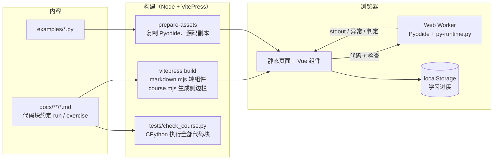

# 项目架构与技术栈

> 本文只说明仓库结构、运行机制与工程约定；课程内容见 [课程大纲](课程大纲.md)。版本取自 `uv.lock`、`site/package-lock.json`，核对日期 2026-10-06。

## 目录与职责

| 路径 | 职责 |
|---|---|
| `docs/` | **唯一内容来源**：课程（`课程/`）、学习路线、大纲、参考文档，均为 Markdown |
| `docs/课程/NN-阶段/` | 每阶段一个目录：`index.md` 导读 + `NN-课.md`；`附录/` 为速查表、术语表 |
| `site/` | VitePress 网站，只负责渲染 `docs/`，不存放课程内容 |
| `site/.vitepress/config.mts` | 站点配置：`srcDir` 指向 `../docs`，导航、搜索、页脚、`base` |
| `site/.vitepress/lib/` | 构建期逻辑：`course.mjs` 扫描课程生成侧边栏与课程元数据；`markdown.mjs` 把代码块转为交互组件、把 `docs/` 外的链接改写为纯文本副本；`blocks.mjs` 解析代码块约定 |
| `site/.vitepress/theme/` | 浏览器端：`PyRunner` / `PyExercise` 组件、CodeMirror 编辑器、`pyodide-client.ts`（Worker 管理与超时）、`progress.ts`（学习进度）、首页路线图、样式 |
| `site/public/py-worker.js` | 模块 Web Worker：加载 Pyodide（本地优先，失败回退 CDN） |
| `site/public/py-runtime.py` | 代码运行时 `course_run(code, check)`：浏览器与本地校验器**共用** |
| `site/scripts/` | `prepare-assets.mjs`（复制 Pyodide 与仓库源码副本）、`serve.mjs`（本机静态服务）、`serve-bg.sh`（后台常驻）、`verify-pyodide.mjs`、`smoke.mjs` |
| `examples/` | 可独立运行的实验代码，如 `agent/minimal_agent.py`（课程终点的阅读对象） |
| `tests/check_course.py` | 课程校验器：执行全部示例与练习，检查结构、链接与版本标注 |
| `.github/workflows/` | `ci.yml`（校验与构建）、`pages.yml`（部署 GitHub Pages） |

## 数据流



1. **内容**：作者只改 `docs/` 下的 Markdown；代码块信息串决定渲染方式（约定见 `site/.vitepress/lib/blocks.mjs` 文件头）。
2. **构建**：`markdown.mjs` 把 `python run` 渲染为 `<PyRunner>`、`python exercise` 渲染为 `<PyExercise>`，代码以 Base64 内嵌；静态高亮作为无 JS 时的回退。
3. **运行**：组件把代码发给 Worker；Worker 调用 `course_run` 在全新命名空间和临时目录中执行，返回输出、异常与耗时。主线程超时 10 秒即终止 Worker 并重建。
4. **判题**：练习分 starter / solution / check 三段；提交时执行“用户代码 + check”，check 中的 `assert` 全部通过即判定通过。
5. **进度**：完成的课与通过的练习记录在浏览器 `localStorage`（键 `jdp-python-course:progress:v1`），不上传。

## 质量保证

| 校验 | 命令 | 内容 |
|---|---|---|
| 课程校验 | `uv run python tests/check_course.py` | CPython 执行全部示例；练习要求 solution 通过、starter 失败；检查课程结构、内部链接、`source=` 副本一致 |
| Pyodide 校验 | `cd site && npm run verify:pyodide` | 在 Node 中用与浏览器相同的 Pyodide 再执行一遍 |
| 冒烟测试 | `cd site && npm run smoke` | Playwright 驱动本机 Chrome：运行、判题、进度、超时、搜索、深色模式 |
| CI | `.github/workflows/ci.yml` | 推送与 PR 时执行以上三项并构建 |

## 技术栈

| 类别 | 技术 | 版本 | 用途 |
|---|---|---|---|
| 语言 | Python（CPython） | 3.12（`.python-version`） | 示例与校验器；课程同时覆盖 3.12–3.14 |
| 环境 | uv | 0.11.x（本机 0.11.17） | 依赖与虚拟环境、`uv.lock` |
| SDK | anthropic | 1.11.0 | `minimal_agent.py` 调用模型（依赖 httpx2 2.13.1、pydantic 2.13.5） |
| 配置 | python-dotenv | 1.2.4 | 读取 `.env` |
| 站点 | VitePress | 1.6.4（Vite 5.4.21） | 静态站点生成 |
| 前端 | Vue | 3.5.43 | 交互组件 |
| 编辑器 | CodeMirror | 6（codemirror 6.0.2，@codemirror/view 6.43.13，lang-python 6.2.1） | 可编辑代码块 |
| 浏览器 Python | Pyodide | 314.0.7（Python 3.14.2） | WebAssembly 版 CPython |
| 搜索 | MiniSearch | 7.2.0（VitePress 本地搜索） | 中文按二元组分词 |
| 高亮 | Shiki | 2.5.0 | 静态代码高亮 |
| 测试 | playwright-core | 1.63.0 | 冒烟测试（使用系统 Chrome，不下载浏览器） |
| 运行时 | Node.js | 22（本机 22.22.3） | 构建与脚本 |

## 命令

```bash
# 校验
uv run python tests/check_course.py
cd site && npm ci && npm run verify:pyodide

# 本地构建与预览（http://127.0.0.1:5180/）
npm run build && npm run preview      # 前台
npm run serve:bg                      # 后台常驻；停止：bash scripts/serve-bg.sh --stop
npm run smoke                         # 站点启动后执行

# GitHub Pages 构建（项目页路径 /jdp-python/）
SITE_BASE=/jdp-python/ SITE_OUT=.vitepress/dist-pages npm run build
node scripts/serve.mjs --root .vitepress/dist-pages --base /jdp-python/ --port 5181
SMOKE_URL=http://127.0.0.1:5181/jdp-python npm run smoke
```

部署：推送到 `main` 后由 `pages.yml` 构建并发布；仓库需启用 Pages（Source 选 GitHub Actions）。

## 设计决策

| 决策 | 理由 |
|---|---|
| `docs/` 为单一内容来源，`site/` 只渲染 | 文档在 GitHub 上可直接阅读；站点可替换 |
| 浏览器与校验器共用 `py-runtime.py` | 本地验证通过即代表浏览器行为一致，避免两套判题逻辑 |
| Pyodide 在 Web Worker 中运行 | 不阻塞页面；死循环可通过终止 Worker 恢复 |
| Pyodide 文件随站点发布，CDN 兜底 | 离线可用；约 15 MB，远低于 Pages 限制 |
| 进度只存 `localStorage` | 无后端、无账号、不收集数据 |
| `base` 由环境变量 `SITE_BASE` 决定 | 同一套代码同时支持本机根路径与 Pages 子路径 |
| 自写 `serve.mjs` | `vitepress preview` 会监听所有网卡；自写服务器只绑定 127.0.0.1 |

## 限制

- 浏览器中不能安装任意第三方包、不能访问本机文件与网络；真实 SDK 调用只能在本地运行。
- 判题依赖可见的检查代码，适合自学，不适合考试场景。
- 进度保存在单个浏览器，换设备或清除站点数据会丢失。
- 首次运行需下载约 15 MB 的 Pyodide 文件，之后由浏览器缓存。
- 冒烟测试需要本机安装 Chrome / Chromium。
